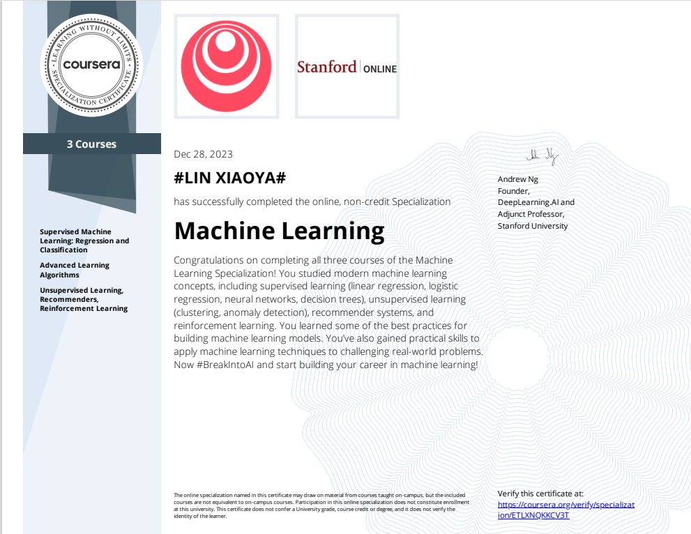
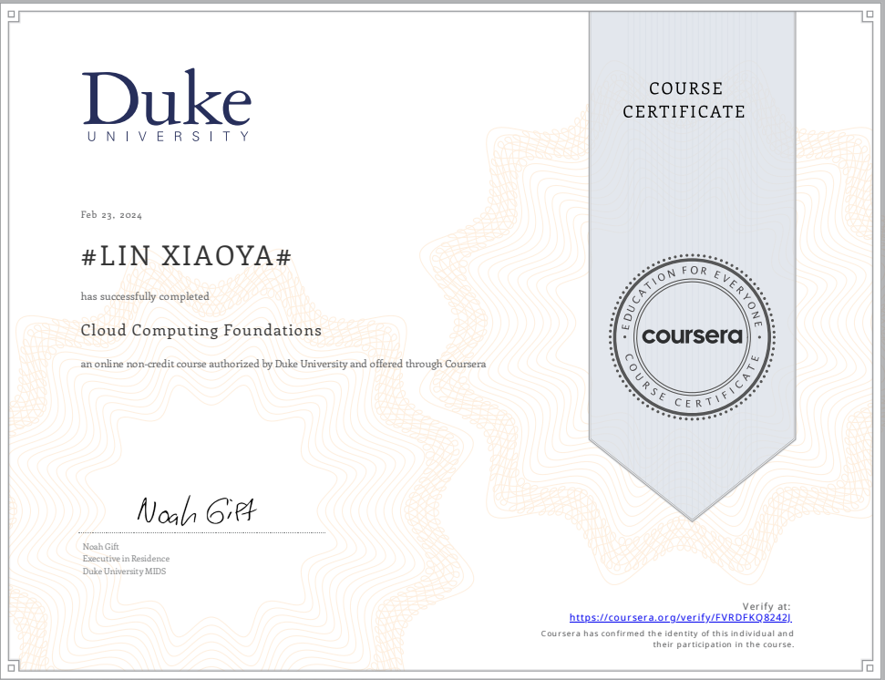
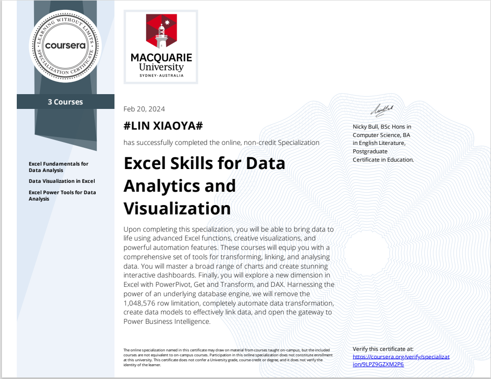
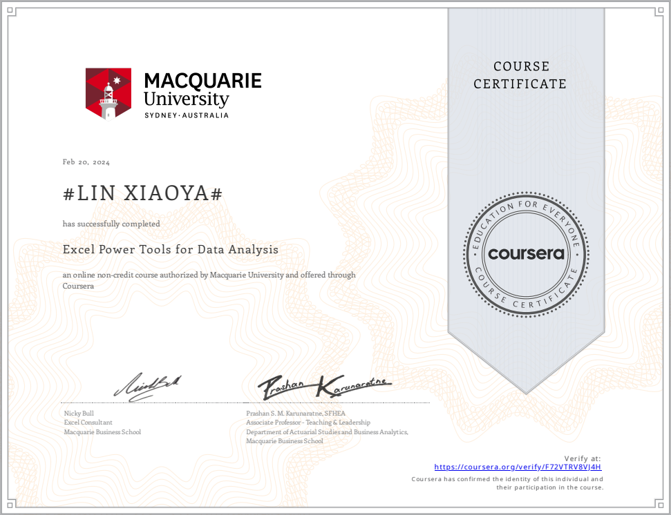
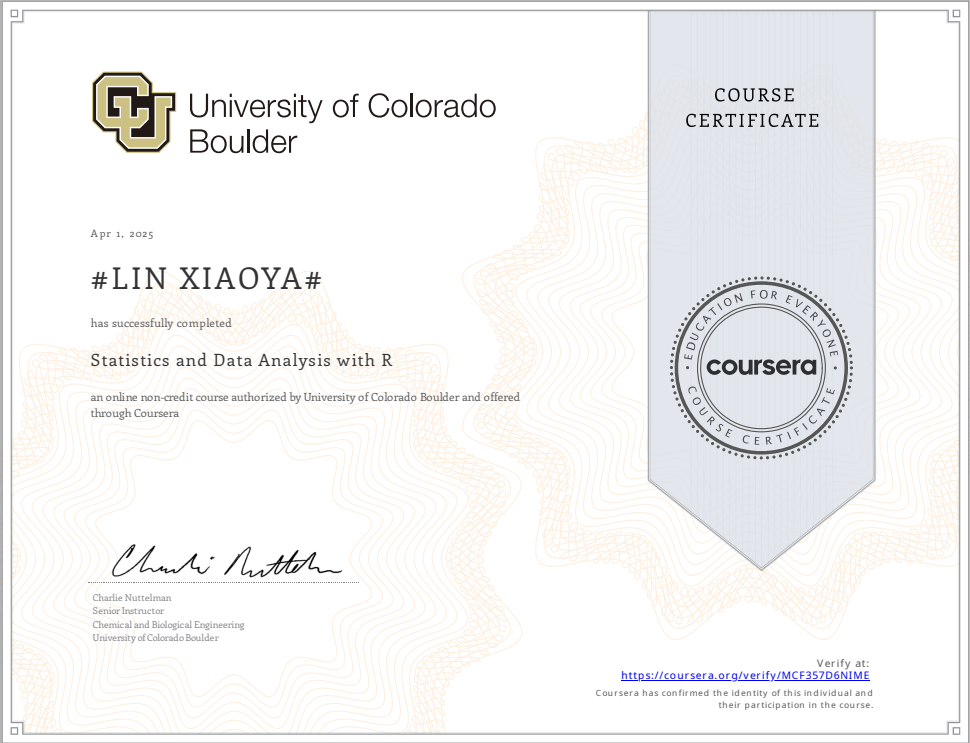

# 👋 Hi there!
I'm **Lin Xiaoya (林小雅)**, an aspiring researcher at [Nanyang Technological University](https://www.ntu.edu.sg/), Singapore.

## 🎓 Education & Research Focus  
**Bachelor of Electrical & Electronic Engineering (Year 3)**  
**CGPA: 4.89 (Highest Distinction Hornour)**  
**Specialization:** Data Science and Machine Learning  
**Research Interests:** Image Restoration · Diffusion Model · Deepfake Detection  
**Languages**: English (en), 中文 (zh), Français (fr)  
**Honors**: **Dean’s List(23-24, 24-25)** · **NTU Science & Engineering Scholarship** · **NTU President Research Scholar** · **ICUR Presenter**  

📄 [Lin Xiaoya's Curriculum Vitae](LinXiaoya_Resume_Research.pdf)

## 👩‍💻 Work Experience

### **[Shenzhen InnoX Academy](https://en.innoxsz.com) – Market Data Analyst Intern**  
*Dec 2025 – Feb 2026 | Hybrid* 

- Supported a startup’s **global expansion** by integrating market insights with business strategy.
- Conducted **competitive monitoring**, user behavior tracking, and sentiment analysis; produced data reports.
- Used **BI tools (Tableau) and Excel** for data visualization and pivot analysis to support decision-making.
- Led **industry research and persona profiling** through expert interviews and secondary data.
- Collaborated cross-functionally with **product, ops, and marketing teams** to translate analytics into actionable strategies.
- Supported the startup team in participating **CES 2026 (Los Angeles)**, contributing to product showcase strategy and market engagement planning.

### **[GlobalFoundries](https://gf.com/) - Data Scientist Intern**   
*May 2025 – Dec 2025 | Singapore*  
**Research Focus: Intelligent Data Engineering for Scalable Analysis and Visual ML**

**Project 1: [Scalable Trace Data Pipeline & Compression for Semiconductor Analytics](https://github.com/LinXiaoya0228/FDCDataExtractor)**  
- Designed and deployed a modular pipeline using **AWS S3**, **PySpark**, **Parquet** and **Snappy** to process multi-month trace data across tools.  
- Enabled **multi-tool, multi-month analysis** with schema alignment and long-to-wide transformation, reducing extraction time from **hours to 4–8 minutes**. 
- Achieved **90% storage reduction**, eliminated memory crashes, and unlocked parameter-level filtering for engineers.

**Project 2: [Hybrid Fault Detection via Trace-to-Image Machine Learning Model](https://github.com/LinXiaoya0228/semiconductor-fault-detection)**  
- Developed a **two-stage Guard-band + OC-SVM architecture** for unsupervised fault detection in semiconductor manufacturing. 
- Converted time-series traces into **Gramian Angular Field (GAF)** images for ML-based classification.
- Addressed training contamination and subtle anomaly detection through statistical filtering and image-based encoding. 
- Achieved **95.05% accuracy, 0.89 recall,** and **1.00 precision (0 False Alarm)**, outperforming traditional guard-band SPC methods by **14%**.

### **[A*STAR](https://www.a-star.edu.sg/) - Healthcare Data Pre-Processing Research Intern**  
*Jan 2025 – Apr 2025 | Singapore*  
- Co-led a team of 5 interns in a collaborative project with **National Healthcare Group (NHG)** to anonymize facial healthcare datasets for AI validation. 
- Applied **rPPG-based feature preservation** to optimize preprocessing for downstream model performance. 
- Delivered insights to clinical and technical stakeholders through structured reporting and presentations. 

### **[Classbro (Shanghai DAOBI EdTech)](https://www.classbro.com/) - Data Science & ML Instructor**  
*Jun 2024 – Dec 2024 | Hybrid*  
- Developed and delivered bilingual lectures on core ML algorithms and SQL  
- Designed course content that contributed **SGD 10,000+ revenue growth**

## 🔬 Selected Projects
### [Remote Photoplethysmography (rPPG) via Self-Supervised Learning](https://github.com/0228lin/remote-photoplethysmography-ssl)
- Built self-supervised pipeline for heart rate estimation from facial video  
- Used PhysNet + contrastive learning in frequency/temporal domains  
- Achieved sub-30ms inference latency via PyTorch DDP

### **URECA Project – AlzCare Smart Watch** *(Aug 2024 – May 2025)*  
- Spearheaded a team in the conceptual design and prototyping of an AI-powered wearable device for dementia patients, with features for real-time health monitoring, fall detection, and geofencing.
- Collaborated with SG Jamiyah Nursing Home to define project requirements and evaluate initial design concepts, gaining experience in translating real-world needs into a technical solution.

### **Hotel Booking Trends & Cancellation Forecasting** *(Feb 2024 – Apr 2024)*  
- Led a 4-member team to analyze booking behavior using **TensorFlow, L2 regularization, Batch Normalization**.
- Achieved **91% accuracy** in cancellation prediction  
- Delivered insights to 50+ peers and instructors through visual storytelling and model documentation.  

### **EV Transition Database Analysis** *(Aug 2023 – Nov 2023)*  
- Used MySQL & MongoDB to assess EV infrastructure in Singapore  
- Proposed strategic recommendations for sustainable transportation

## 📜 Certifications & Skills

### 🧠 Machine Learning & Cloud

<table cellspacing="20">
  <tr>
    <td width="50%" valign="top">
      
       <strong>Machine Learning</strong> – DeepLearning.AI, Stanford University  
       <em>Skills:</em> Supervised & Unsupervised Learning · Neural Networks · Regularization · Bias-Variance Tradeoff · ML System Design
    </td>
    <td width="50%" valign="top">
      
       <strong>Cloud Computing Foundations</strong> – Duke University  
       <em>Grade:</em> 97.50%  
       <em>Skills:</em> Cloud Architecture · Virtualization · SaaS vs IaaS · Scalability · Security Principles
    </td>
  </tr>
</table>

---

### 📊 Data Analytics & Visualization (Excel)

<table cellspacing="20">
  <tr>
    <td width="50%" valign="top">
      
       <strong>Excel Skills for Data Analytics and Visualization</strong> – Macquarie University  
       <em>Skills:</em> Pivot Tables · Dashboards · Conditional Formatting · Data Cleaning · Charting Techniques
    </td>
    <td width="50%" valign="top">
      
       <strong>Excel Fundamentals for Data Analysis</strong> – Macquarie University  
       <em>Skills:</em> Lookup Functions · Logical Operators · Data Types · Spreadsheet Design
    </td>
  </tr>
  <tr>
    <td width="50%" valign="top">
      
       <strong>Excel Power Tools for Data Analysis</strong> – Macquarie University  
       <em>Skills:</em> Power Query · Power Pivot · DAX · Data Modeling
    </td>
    <td width="50%" valign="top">
      
       <strong>Data Visualization in Excel</strong> – Macquarie University  
       <em>Skills:</em> Advanced Charting · Interactive Dashboards · Storytelling with Data
    </td>
  </tr>
</table>

---

### 📈 Statistical Analysis & Programming (R)

<table cellspacing="20">
  <tr>
    <td width="50%" valign="top">
      
       <strong>Statistics and Data Analysis with R</strong> – University of Colorado Boulder  
       <em>Skills:</em> Hypothesis Testing · Regression · ANOVA · Data Wrangling · ggplot2
    </td>
  </tr>
</table>

## 🧰 Featured Technologies & Tools  

### 🗣️ Languages

---

### 🧠 Libraries & Frameworks

---

### ☁️ Cloud & Big Data

---

### 🗄️ Databases

## 🌱 Community & Leadership  
- **NTU Institution of Engineering and Technology [IET](https://www.theiet.org/)**, Liaison Manager (Jul 2024 – Present)  
  Coordinated company visits to **A*STAR, Nestlé, SBS Transit, GlobalFoundries**.

- **NTU Investment Interactive Club [IIC](https://blogs.ntu.edu.sg/sao-ntuiic/)**, Subcommittee (Jul 2024 – Present)  
  Organized investment conferences with **200+ participants**.

- **CFLS-MUN**, Academic Director (Dec 2019 – Dec 2021)  
  - Chaired the **North-East MUN** Conference with **1,000+ attendees** 
  - Led delegations to **World MUN & Yale MUN** 
  - Trained **100+ students** in resolution drafting, diplomacy, and public speaking  

## 📌 Connect With Me  
[Email](mailto:LINX0070@e.ntu.edu.sg) | [LinkedIn](https://www.linkedin.com/in/xiaoya-lin/) | [GitHub](https://github.com/LinXiaoya0228) | [Wechat](wechat.png)

---

<!---
0228lin/0228lin is a ✨ special ✨ repository because its `README.md` (this file) appears on your GitHub profile.
You can click the Preview link to take a look at your changes.
--->

# Hi there, I'm Lin Xiaoya (林小雅) 👋

### Data Scientist & Researcher | Specialized in Semiconductor AI & Healthcare

**Nanyang Technological University (NTU)** | CGPA: **4.89** (Highest Distinction) | Dean's List (Top 5%)

---

## 🚀 Industrial Engineering Highlights (GlobalFoundries)

> [cite_start]*During my 7-month internship at GlobalFoundries, I combined technical innovation with rigorous research to resolve complex engineering challenges[cite: 44]. Below are the visual demonstrations of these pipelines.*

<table width="100%">
  <tr>
    <td width="55%">
      <h3>1. Scalable Trace Data Pipeline & Compression</h3>
      

        <strong>The Problem:</strong> Processing multi-month sensor traces caused memory crashes and took hours. 
        [cite_start]<strong>The Solution:</strong> Built a scalable ETL pipeline using <code>AWS SageMaker</code>, <code>PySpark</code>, and <code>Snappy</code> compression[cite: 46].
      

      <ul>
        <li>📉 <strong>90%</strong> Reduction in storage file size[cite: 47].</li>
        <li>⚡ <strong>97%</strong> Faster data extraction time[cite: 47].</li>
        <li>🛠 <strong>Tech:</strong> PySpark, AWS Boto3, Parquet.</li>
      </ul>
       
       <blockquote>
        "The solution developed addressed scalability issues... resulted in 90% reduction in file size." 
        — <em>Khoo Yong, MTS, GlobalFoundries [cite: 46, 47, 57]</em>
      </blockquote>
       
      
    </td>
    <td width="45%">
      
    </td>
  </tr>
</table>

<table width="100%">
  <tr>
    <td width="55%">
      <h3>2. Trace-to-Image Fault Detection (GAF-CNN)</h3>
      

        <strong>The Problem:</strong> Existing methods were not suitable for classifying unlabeled equipment parameter traces[cite: 49]. 
        <strong>The Solution:</strong> Engineered a novel ensembled method of <strong>Guard-Band + OC-SVM</strong> using Gramian Angular Fields (GAF)[cite: 49].
      

      <ul>
        <li>🎯 <strong>95%</strong> Accuracy (Outperforming Guard-Band by 14%)[cite: 50].</li>
        <li>🛡 <strong>Valid</strong> for unlabeled anomalies[cite: 49].</li>
        <li>🖼 <strong>Tech:</strong> Python, GAF Imaging, CNN, Autoencoders.</li>
      </ul>
       
       <blockquote>
        "Her final model achieved a higher accuracy than traditional Guard-Band method by 14%." 
        — <em>Khoo Yong, MTS, GlobalFoundries [cite: 50, 57]</em>
      </blockquote>
       
      
    </td>
    <td width="45%">
      
    </td>
  </tr>
</table>

---

## 🏆 Recommendation Letter

<table width="100%">
  <tr>
    <td width="70%" valign="top">
      <h3>Endorsement from Internship Supervisor</h3>
      
My work was supervised by Mr. Khoo Yong (Member of Technical Staff, GlobalFoundries)[cite: 44, 57].

      <blockquote>
        "I was able to observe first-hand her ability to combine technical innovation with rigorous research capability... I am confident she will excel in her PhD program and in future Data Science/ Engineering roles." [cite: 44, 54]
      </blockquote>
    </td>
    <td width="30%" valign="top" align="center">
      
       
      Click to read full letter
    </td>
  </tr>
</table>

---

## 🔬 Research & Academic Gallery

| **A*STAR Healthcare Data** | **AlzCare Smart Watch** | **Hotel Booking AI** |
|:---:|:---:|:---:|
|  |  |  |
| **Research Intern** | **URECA Team Lead** | **Course Project Lead** |
| Developed **rPPG feature preservation** workflows for anonymized medical datasets. Influenced NHG data governance strategies. | Prototyped an AI-wearable for dementia patients. Conducted user research at **Jamiyah Nursing Home**. | Achieved **91% accuracy** in cancellation forecasting using **TensorFlow** & Batch Normalization. |

---

## 🛠 Tech Stack & Tools

  
<strong>📚 Click to view Certifications</strong>

   
  <ul>
    <li><strong>Machine Learning</strong> (Stanford University/DeepLearning.AI)</li>
    <li><strong>Cloud Computing Foundations</strong> (Duke University) - <em>97.5% Grade</em></li>
    <li><strong>Excel Skills for Data Analytics</strong> (Macquarie University)</li>
    <li><strong>Statistics with R</strong> (University of Colorado Boulder)</li>
  </ul>

 

**Languages**

**Machine Learning & Vision**

**Big Data & Cloud**

---

  
  
   
  Last Updated: Dec 2025 | 📍 Singapore

# Hi there, I'm Lin Xiaoya (林小雅) 👋

### Data Scientist & Researcher | Specialized in Semiconductor AI & Healthcare

**Nanyang Technological University (NTU)** | CGPA: **4.89** (Highest Distinction) | Dean's List (Top 5%)

---

## 🚀 Industrial Engineering Highlights (GlobalFoundries)

> *During my 7-month internship at GlobalFoundries, I combined technical innovation with rigorous research to resolve complex engineering challenges. Below are the visual demonstrations of these pipelines.*

<table width="100%">
  <tr>
    <td width="55%">
      <h3>1. Scalable Trace Data Pipeline & Compression</h3>
      

        <strong>The Problem:</strong> Processing multi-month sensor traces caused memory crashes and took hours. 
        <strong>The Solution:</strong> Built a scalable ETL pipeline using <code>AWS SageMaker</code>, <code>PySpark</code>, and <code>Snappy</code> compression.
      

      <ul>
        <li>📉 <strong>90%</strong> Reduction in storage file size.</li>
        <li>⚡ <strong>97%</strong> Faster data extraction time.</li>
        <li>🛠 <strong>Tech:</strong> PySpark, AWS Boto3, Parquet.</li>
      </ul>
       
       <blockquote>
        "The solution developed addressed scalability issues... resulted in 90% reduction in file size." 
        — <em>Khoo Yong, MTS, GlobalFoundries</em>
      </blockquote>
       
      
    </td>
    <td width="45%">
      
    </td>
  </tr>
</table>

<table width="100%">
  <tr>
    <td width="55%">
      <h3>2. Trace-to-Image Fault Detection (GAF-CNN)</h3>
      

        <strong>The Problem:</strong> Existing methods were not suitable for classifying unlabeled equipment parameter traces. 
        <strong>The Solution:</strong> Engineered a novel ensembled method of <strong>Guard-Band + OC-SVM</strong> using Gramian Angular Fields (GAF).
      

      <ul>
        <li>🎯 <strong>95%</strong> Accuracy (Outperforming Guard-Band by 14%).</li>
        <li>🛡 <strong>Valid</strong> for unlabeled anomalies.</li>
        <li>🖼 <strong>Tech:</strong> Python, GAF Imaging, CNN, Autoencoders.</li>
      </ul>
       
       <blockquote>
        "Her final model achieved a higher accuracy than traditional Guard-Band method by 14%." 
        — <em>Khoo Yong, MTS, GlobalFoundries</em>
      </blockquote>
       
      
    </td>
    <td width="45%">
      
    </td>
  </tr>
</table>

---

## 🏆 Recommendation Letter

<table width="100%">
  <tr>
    <td width="70%" valign="top">
      <h3>Endorsement from Internship Supervisor</h3>
      
My work was supervised by Mr. Khoo Yong (Member of Technical Staff, GlobalFoundries).

      <blockquote>
        "I was able to observe first-hand her ability to combine technical innovation with rigorous research capability... I am confident she will excel in her PhD program and in future Data Science/ Engineering roles."
      </blockquote>
    </td>
    <td width="30%" valign="top" align="center">
      
       
      Click to read full letter
    </td>
  </tr>
</table>

---

## 🔬 Research & Academic Gallery

| **A*STAR Healthcare Data** | **AlzCare Smart Watch** | **Hotel Booking AI** |
|:---:|:---:|:---:|
|  |  |  |
| **Research Intern** | **URECA Team Lead** | **Course Project Lead** |
| Developed **rPPG feature preservation** workflows for anonymized medical datasets. Influenced NHG data governance strategies. | Prototyped an AI-wearable for dementia patients. Conducted user research at **Jamiyah Nursing Home**. | Achieved **91% accuracy** in cancellation forecasting using **TensorFlow** & Batch Normalization. |

---

## 📜 Certifications

<table width="100%">
  <tr>
    <td align="center" width="20%">
       
      <strong>Lean Six Sigma</strong> Yellow Belt
    </td>
    <td align="center" width="20%">
       
      <strong>Machine Learning</strong> Stanford (DeepLearning.AI)
    </td>
    <td align="center" width="20%">
       
      <strong>Cloud Computing</strong> Duke University (97.5%)
    </td>
    <td align="center" width="20%">
       
      <strong>Excel Analytics</strong> Macquarie University
    </td>
    <td align="center" width="20%">
       
      <strong>Statistics (R)</strong> Univ. of Colorado
    </td>
  </tr>
</table>

---

## 🛠 Tech Stack & Tools

**Languages**

**Machine Learning & Vision**

**Big Data & Cloud**

---

  
  
   
  Last Updated: Dec 2025 | 📍 Singapore

