

# Hi there, I'm Lin Xiaoya (林小雅) 👋

### Data Scientist & Researcher | Specialized in Data Science & Machine Learning

 

**Nanyang Technological University (NTU)** | CGPA: **4.89** (Highest Distinction Honour) | **Dean's List** AY 23-24, 24-25 (Top 5%)
 
NTU President Research Scholar | NTU Science & Engineering Scholarship Recipient | Presenter at ICUR 2025

---

# 💼 Professional Work Experience

## 1. GlobalFoundries | Data Scientist Intern
*May 2025 – Dec 2025 | Singapore*

> *During my 7-month internship, I combined technical innovation with rigorous research to resolve complex engineering challenges.*

<table width="100%">
  <tr>
    <td width="55%">
      <h3>Trace Data ETL Pipeline</h3>
      

        <strong>The Problem:</strong> Processing multi-month sensor traces caused memory crashes and took hours. 
        <strong>The Solution:</strong> Built a scalable ETL pipeline using <code>AWS SageMaker</code>, <code>PySpark</code>, and <code>Snappy</code> compression.
      

      <ul>
        <li>📉 <strong>90%</strong> Reduction in storage file size.</li>
        <li>⚡ <strong>97%</strong> Faster data extraction time.</li>
        <li>🛠 <strong>Tech:</strong> <code>PySpark</code>, <code>AWS S3/Boto3</code>, <code>Parquet + Snappy</code>, <code>ETL Optimization</code>.</li>
      </ul>
       
      <blockquote>
        "The solution developed addressed scalability issues... resulted in 90% reduction in file size."
      </blockquote>
      
    </td>
    <td width="45%">
      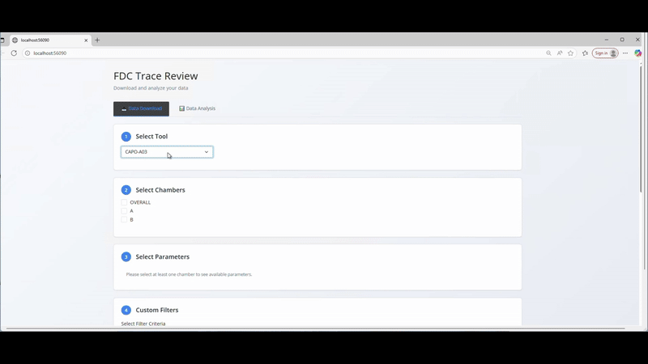
    </td>
  </tr>
</table>

<table width="100%">
  <tr>
    <td width="55%">
      <h3>Trace-to-Image Fault Detection (GAF-CNN)</h3>
      

        <strong>The Problem:</strong> Existing methods were not suitable for classifying unlabeled equipment parameter traces. 
        <strong>The Solution:</strong> Engineered a novel ensembled method of <strong>Guard-Band + OC-SVM</strong> using Gramian Angular Fields (GAF).
      

      <ul>
        <li>🎯 <strong>95%</strong> Accuracy (Outperforming Guard-Band by 14%).</li>
        <li>🛡 <strong>Valid</strong> for unlabeled anomalies (Zero False Alarms).</li>
        <li>🛠 <strong>Tech:</strong> <code>Python (PyTorch)</code>, <code>Gramian Angular Fields (GAF)</code>, <code>CNN</code>, <code>One-Class SVM</code>.</li>
      </ul>
       
      <blockquote>
        "Her final model achieved a higher accuracy than traditional Guard-Band method by 14%."
      </blockquote>
      
    </td>
    <td width="45%">
      
    </td>
  </tr>
</table>

## 🏆 Recommendation Letter

<table width="100%">
  <tr>
    <td width="70%" valign="top">
      <h3>Endorsement from Internship Supervisor</h3>
      
My work was supervised by Mr. Khoo Yong (Member of Technical Staff, GlobalFoundries).

      <blockquote>
        "I was able to observe first-hand her ability to combine technical innovation with rigorous research capability... I am confident she will excel in her PhD program and in future Data Science/ Engineering roles."
      </blockquote>
    </td>
    <td width="30%" valign="top" align="center">
      <a href="assets/recommendation_letter.png">
        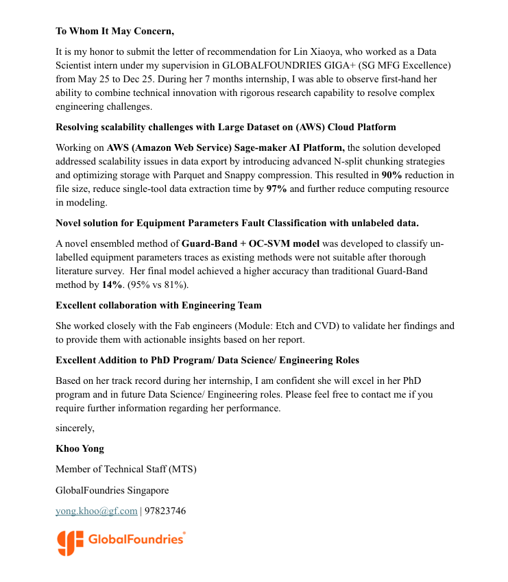
      </a>
       
      Click to read full letter
    </td>
  </tr>
</table>

 

## 2. OCBC Bank | Data Analyst Intern 
*Jan 2026 – Present | Singapore*

> *Spearheaded a multidisciplinary team to modernize HR data infrastructure, balancing agile automation with strict enterprise data privacy governance.*

<table width="100%">
  <tr>
    <td width="60%" valign="top">
      <h3>End-to-End HR Automation Framework</h3>
      

        <strong>The Problem:</strong> Manual data extraction and validation for the Talent Acquisition team were highly inefficient and prone to human error. 
        <strong>The Solution:</strong> Architected a fully automated compliance and analytics pipeline utilizing <strong>Power Automate and Python</strong>.
      

      <ul>
        <li>⚙️ <strong>Workflow Automation:</strong> Designed conditional cloud flows (SharePoint/OneDrive triggers) to automate data ingestion and array mapping.</li>
        <li>📩 <strong>Exception Handling:</strong> Automated targeted Outlook/Teams communications for missing or invalid compliance data points.</li>
        <li>📊 <strong>Analytics:</strong> Developed a <strong>Power BI</strong> dashboard to track "Active Requisitions" and recruiter performance metrics.</li>
        <li>🛡 <strong>Tech:</strong> <code>Power Automate</code>, <code>Python</code>, <code>Power BI</code>, <code>SharePoint</code>, <code>Excel Online (Business)</code>.</li>
      </ul>
       
      <blockquote>
        <strong>Note on NDA:</strong> Due to strict banking data privacy regulations, the actual enterprise codebase and internal flow architectures are highly classified. 
          
        👉 <em>To demonstrate the underlying logic, a functional replica using mock, non-sensitive data is showcased on the right.</em>
      </blockquote>
    </td>
    <td width="40%" align="center" valign="top">
       
      <strong>Mock Architecture Demo</strong> 
      <a href="assets/power_automate_flow.png" target="_blank">
        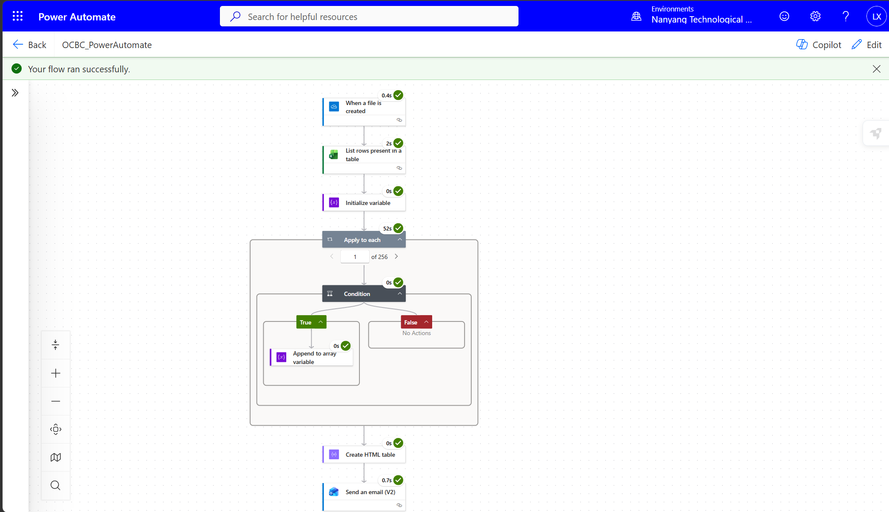
      </a>
        
      <strong>Automated Output Report</strong> 
      <a href="assets/automated_email.png" target="_blank">
        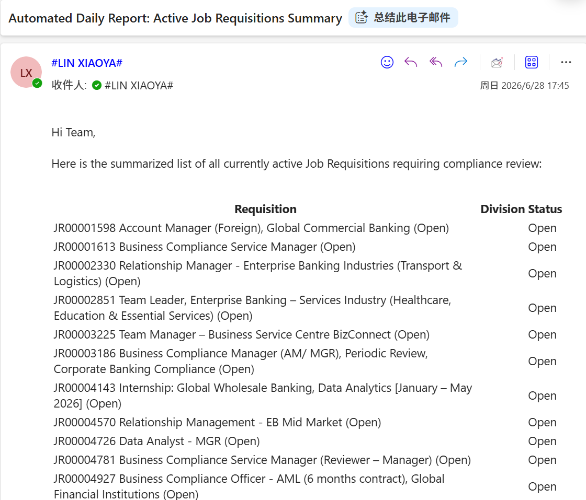
      </a>
    </td>
  </tr>
</table>

 

## 3. Shenzhen InnoX Academy | Market Data Analyst Intern
*Dec 2025 – Jan 2026 | Hybrid*

<table width="100%">
  <tr>
    <td width="60%">
      <h3>Project: "Interactive Clothes" GTM Strategy</h3>
      

        <strong>The Problem:</strong> The product lacked market fit, oscillating between saturated "fitness" and "gaming" markets with high CAC. 
        <strong>The Solution:</strong> Pivoted to "Somatic Wellness" via Python sentiment analysis and engineered the digital launch infrastructure.
      

      <ul>
        <li>🚀 <strong>500+ Leads</strong> captured in 48h via custom Landing Page.</li>
        <li>📊 <strong>Analytics:</strong> Mined competitor reviews to identify "Subscription Fatigue" as a key pain point.</li>
        <li>🛠 <strong>Tech:</strong> <code>Python (NLP)</code>, <code>Tableau</code>, <code>HTML5/Tailwind</code>, <code>GTM Strategy</code>.</li>
      </ul>
       
      
    </td>
    <td width="40%" align="center">
      
        
      
        
      
    </td>
  </tr>
</table>

 

## 4. A*STAR | Healthcare Data Research Intern
*Jan 2025 – Apr 2025 | Singapore*

**Project: Anonymization Workflows for Confidential Medical Datasets**
* Co-led a team of 5 in a collaboration with **SG National Healthcare Group (NHG)** to anonymize facial healthcare datasets for AI validation.
* Addressed the trade-off between data utility and patient privacy, a core challenge in observational healthcare data.
* Performed feature preservation analysis through rPPG-tool to optimize preprocessing for downstream AI performance.

 

## 5. Classbro (Shanghai DAOBI EdTech) | Data Science Instructor
*Jun 2024 – Dec 2024 | Hybrid*

* Developed and delivered bilingual lectures on core ML algorithms and SQL.
* Designed course content that contributed **SGD 10,000+ revenue growth**.

---

# 🛠 Projects & Research

### 1. AlzCare: AI-Powered Dementia Care Platform

<table style="border: none; border-collapse: collapse; width: 100%;">
  <tr>
    <td width="50%" valign="top" style="padding-right: 20px; border: none;">
      
<strong>The Problem:</strong> Dementia patients face risks of wandering, missed medication, and delayed health intervention. 
      <strong>The Solution:</strong> Developed an all-in-one web platform integrating <code>Geofencing</code>, <code>AI Health Reporting</code>, and <code>Automated Reminders</code>.

      <ul>
        <li>📍 <strong>Geofencing:</strong> Real-time wandering alerts using Google Maps API & WebSockets</li>
        <li>🧠 <strong>Health Analytics:</strong> AI-driven insights for early intervention</li>
        <li>📅 <strong>Smart Scheduling:</strong> Auto-syncs with Google Calendar for medication reminders</li>
      </ul>
      
<strong>Tech Stack:</strong> React.js · Node.js · Google Maps API

      
<em>Presented at the <strong>International Conference of Undergraduate Research (ICUR) 2025</strong></em>

    </td>
    <td width="50%" valign="top" align="center" style="border: none;">
      
      
▶ Click to Watch Demo

    </td>
  </tr>
  
  <tr>
    <td width="50%" valign="top" align="center" style="border: none; padding-top: 15px;">
      <a href="./Certifications/icur-poster.png" target="_blank" title="Click to view Poster">
        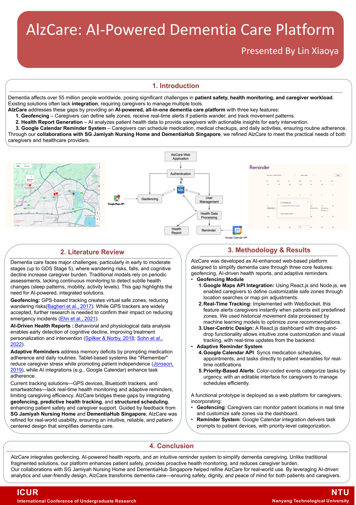
      </a>
      
📄 View Poster

    </td>
    <td width="50%" valign="top" align="center" style="border: none; padding-top: 15px;">
      <a href="./Certifications/icur-cert.png" target="_blank" title="Click to view Certificate">
        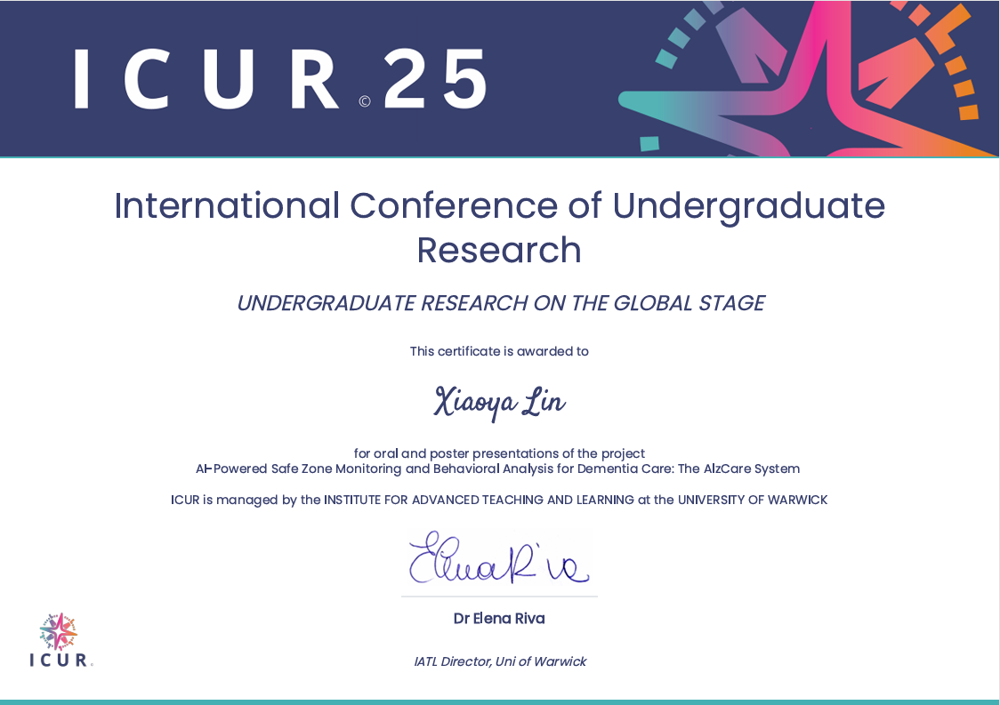
      </a>
      
🏆 View Certificate

    </td>
  </tr>
</table>

### 2. Hotel Booking Trends & Cancellation Forecast
**Course Project Lead**
* Led a 4-member team to analyze booking behavior and predict cancellations.
* Optimized model to **91% accuracy** using **TensorFlow**, L2 regularization, and Batch Normalization.
* Delivered visual storytelling insights to 50+ course instructors and peers.

---

# 📜 Certifications

<table width="100%">
  <tr>
    <td align="center" width="33%">
       
      <strong>Lean Six Sigma Yellow Belt</strong> 
      <small>Process Improvement · DMAIC · Root Cause Analysis · Waste Reduction</small>
    </td>
    <td align="center" width="33%">
      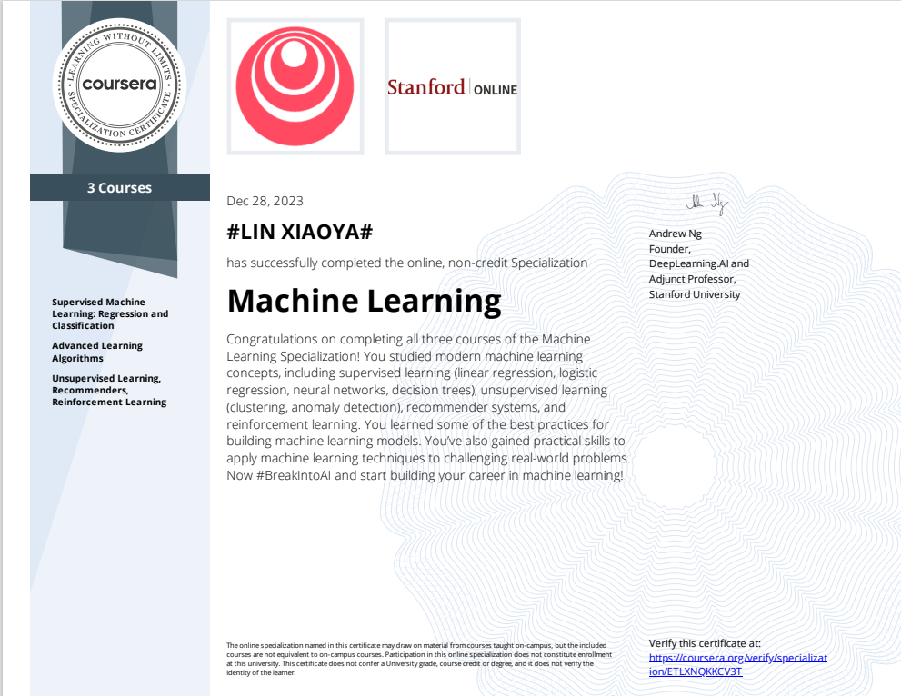 
      <strong>Machine Learning</strong> 
      <small>Supervised/Unsupervised Learning · Neural Networks · Regularization · Bias-Variance Tradeoff</small>
    </td>
    <td align="center" width="33%">
      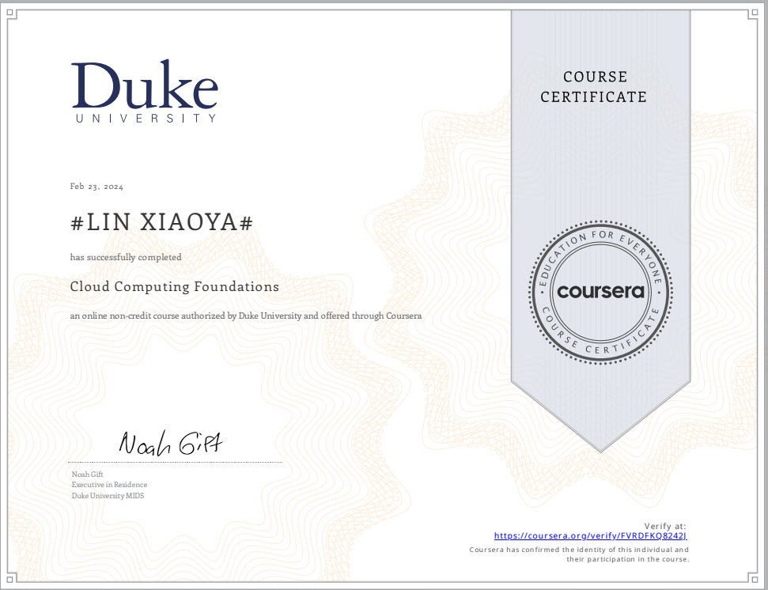 
      <strong>Cloud Computing</strong> 
      <small>Cloud Architecture · Virtualization · SaaS vs IaaS · Docker · CI/CD Pipeline</small>
    </td>
  </tr>
  <tr>
    <td align="center" width="33%">
      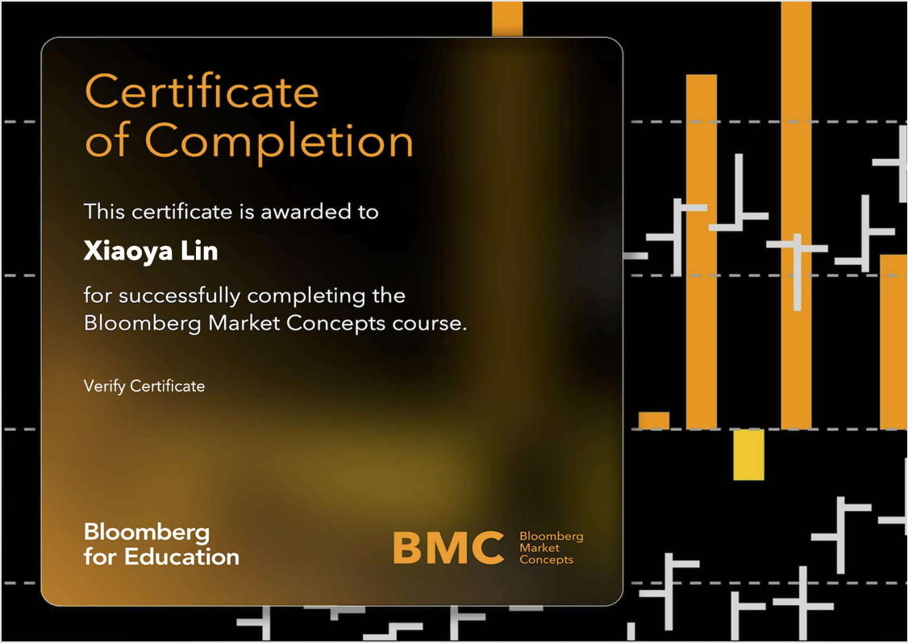 
      <strong>Bloomberg Market Concepts</strong> 
      <small>Economic Indicators · Currencies · Fixed Income · Equities · Terminal Functions</small>
    </td>
    <td align="center" width="33%">
      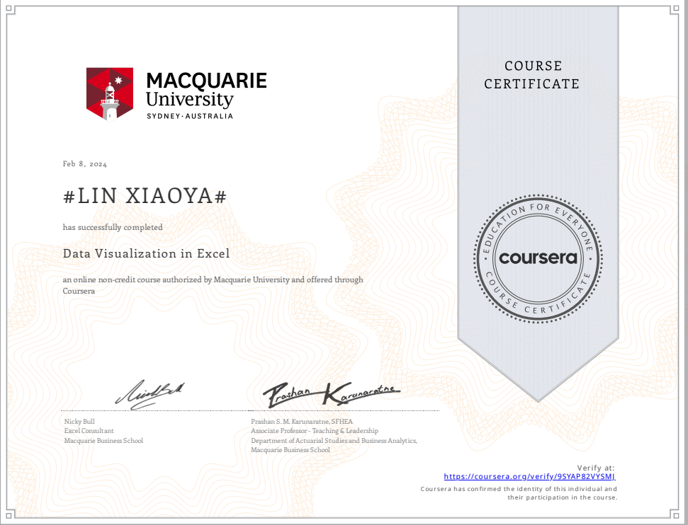 
      <strong>Excel Analytics</strong> 
      <small>Advanced Charting · Pivot Tables · Interactive Dashboards · Data Storytelling</small>
    </td>
    <td align="center" width="33%">
      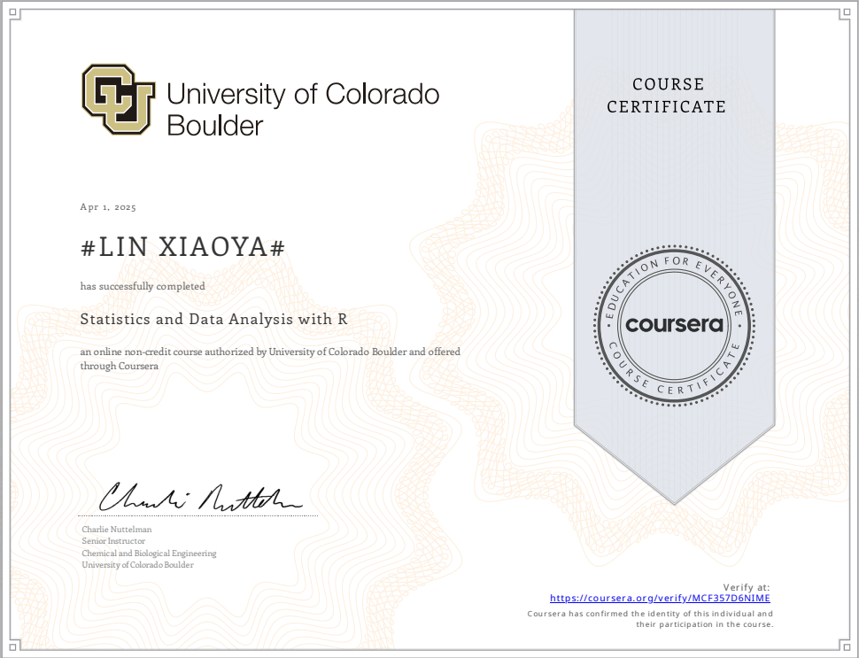 
      <strong>Statistics (R)</strong> 
      <small>Hypothesis Testing · Regression Analysis · ANOVA · Data Wrangling · ggplot2</small>
    </td>
  </tr>
</table>

---

# 🌱 Community & Leadership

* **NTU Institution of Engineering and Technology ([IET](https://www.theiet.org/))** | *Liaison Manager (Jul 2024 – Present)*
    * Coordinated company visits to **A*STAR, Nestlé, SBS Transit, and GlobalFoundries**, connecting students with industry professionals.

* **NTU Investment Interactive Club ([IIC](https://blogs.ntu.edu.sg/sao-ntuiic/))** | *Subcommittee (Jul 2024 – Present)*
    * Planned and executed key conferences, curating speaker panels and attracting **200+ participants**.

* **CFLS Model United Nation Club (CFLS-MUN)** | *Academic Director (Dec 2019 – Dec 2021)*
    * Chaired the North-East MUN Conference (**1,000+ participants**) and led delegations to World MUN & Yale MUN.
    * Trained **100+ members** in resolution drafting and diplomacy skills.

---

# 🛠 Tech Stack & Tools

**Languages**

**Machine Learning & Vision**

**Big Data & Cloud**

   
  Last Updated: Feb 2026 | 📍 Singapore

